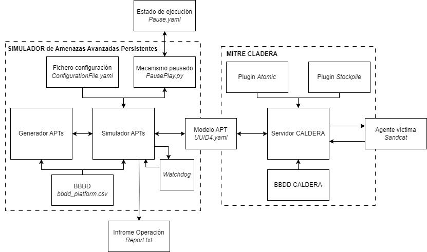

# APT_Simulator_TFM

## Tabla de contenido
* [Información general](#información-general)
* [Tecnologías](#tecnologías)
* [Instalación](#instalación)
* [Ejecución](#ejecución)


## Información General
Como solución se propone el desarrollo de un proyecto para el modelado y simulación de APTs basada en inteligencia artificial, para su uso en pruebas de penetración en entornos simulados. El proceso de generación del modelo se basa en la construcción de cadenas de habilidades aplicando el algoritmo de aprendizaje por refuerzo Q-Learning. Este proyecto tiene como objetivo la definición formal de los modelos que permitan caracterizar los APTs siguiendo el estándar MITRE.
Esta herramienta ha sido desarrollada y probada en versiones previas para su implementación en el proyecto COBRA. Este proyecto, financiado por el Mando Conjunto del Ciberespacio (MCCE) del gobierno Español, está orientado al desarrollo de cibermaniobras adaptables y personalizables de simulación hiperrealista de APT, así como entrenamiento en ciberdefensa a través de la gamificación. COBRA.

<p align="center">
  
  <h5 align="center"> Arquitectura herramienta de generación y simulación de APTs </h5>
</p>


## Tecnologías
El proyecto se ha creado utilizando las siguientes tecnologías:
* Python versión ````3.7.9````
* VirtualBox: Software de virtualización desarrollado por Oracle Corporation que permite crear y gestionar máquinas virtuales aisladas en un entorno de máquina host. [Pagina oficial]([https://attack.mitre.org/](https://www.virtualbox.org/)) de VirtualBox.
* MITRE ATT&CK® (Adversarial Tactics, Techniques, and Common Knowledge): herramienta dedicada a la comprensión y clasificación de tácticas, técnicas y procedimientos (TTPs) empleados por adversarios en los ciberataques. [Pagina oficial](https://attack.mitre.org/) de MITRE.
* CALDERA ````4.1````: proyecto de ciberseguridad desarrollado por MITRE Corporation que se basa en el marco MITRE ATT&CK. CALDERA es una plataforma diseñada para realizar simulaciones de ataques y pruebas de penetración. Para más información, acceda a la [documentación](https://caldera.readthedocs.io/en/latest/) oficial de CALDERA.


## Instalación
* Previo a la instalación del proyecto, deberá tener instalado el software de virtualización virtualBox. Para más información en como instalar esta herrmaineta, acceda a este enlace: [Pagina oficial]([https://attack.mitre.org/](https://www.virtualbox.org/)) de VirtualBox. Adicionalmente, deberá contar con una máquina Linux Ubunutu donde se despelgará la herrmianta y servidor CALDERA. Para la creación de máquinas víctimas, deberá contar con una máquina virtual Linux Ubuntu o windows. El escenario simulado en este proyecto consiste en una máquina atacante Linux Ubuntu 20.04 que alberga la herramienta de simulación de APTs y una máuquina Linux Ubuntu 22.04, donde se desplegará la víctima.
* Adicionalmente, se deberá instalar python en ambas máquinas.
```$ sudo apt install python3```
**Nota:** Para comprobar la versión de python instalada, puede ejecutar el siguiente comando: ```python3 --verison```.

Para el arranque del proyecto deberá:
* En la máquina atacante deberá instalar la carpeta envSimulator. Esta carteta contiene la herrmianta de modelado de APTs aplicando algoritmos de aprendizaje por refuerzo ```APTSimulator_V2``` y la herrmianta empleada para la simulación de APTs ```caldera4.1```. El directorio se podrá descargar de forma manual o através de el siguiente comnado.
```$ sudo apt-get install https://github.com/OscarJoverWalsh/APT_Simulator_TFM.git```
* En la máquina víctima deberá instalar la carpeta Agent. Esta contiene el script necesario para conectar el agente con el servidor CALDERA.


## Ejecución
Previo a la ejecución, el escenario deberá ser el siguiente: Por un lado, la máquina atacante con la carpeta envSimulator y por otro lado, la máquina víctima con la carpeta Agente, ambas carpetas situada dentro de sus respectivos directorios ```/home```.

Una vez instaldo el programa, se podrá ejecutar siguiendo los pasos a continuación.

1º Lanzamos dos terminales en la máquina atacante. En el primero de ellos nos desplazaremos al directorio de trabajo deonde se encuentre el directorio ```caldera4.1```. El el segundo, nos desplazaremos a la directorio de trabajo ```APTSimulator_V2```.

2º Desde el terminal situado en ```caldera4.1``` lanzamos el siguiente comando ```$ python3 server.py--insecure```. Con ello lanzamos el servidor CALDERA. Una vez recibido el mensaje ```INFO  (server.py:72 run_tasks) All systems ready.```, podemos abrir a nuestro navegador y acceder a la dirección ```http://0.0.0.0:8888/?#home```. A continuación introduciremos las credenciales del usuario administrador. User: ```admin```, Password: ```admin```.

3º Lamzamos un nuevo terminal en la máquina víctima y nos desplazamos al directorio ```Agent```. A continuación, ejecutamos el comnado ```sudo bash ubuntuAgent.sh``` para conectar un nuevo agente al servidor caldera levantado. Si se realiza correctamente debemos observar el mensaje repetido ```Beacon (HTTP): ALIVE```. Si accedemos al menú agents del servidor caldera, también debemos observar la creación de un nuevo agente.

4º Finalmente, desde el segundo terminal en la máquina atacante, ejecutamos el comando ```python3 main.py``` para lanzar la herrmienta de generación y simulación de APTs.
